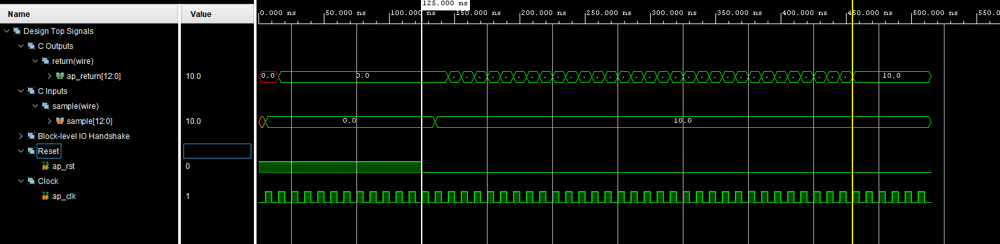
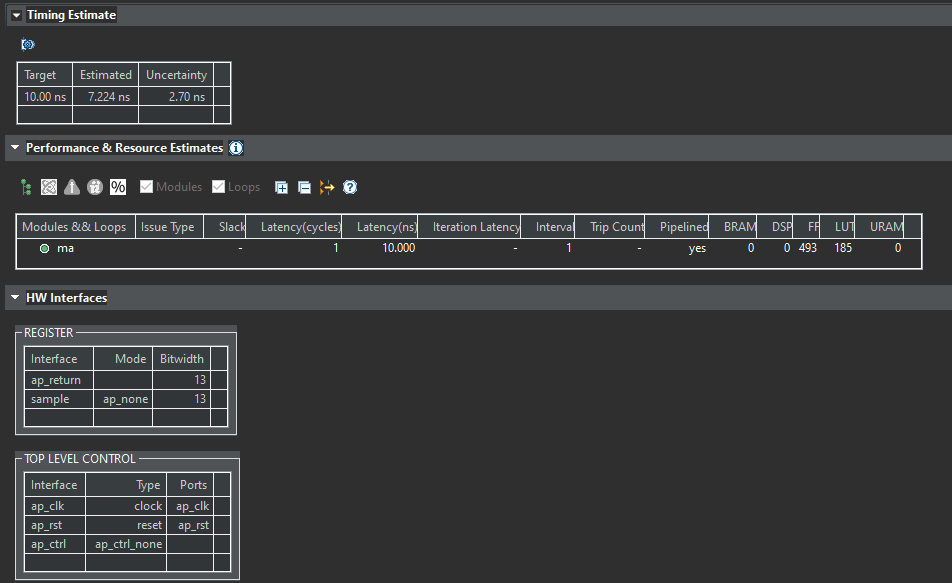

## Simple moving average filter in Xilinx HLS



Moving average filter with 1 tick of latency.
Filter depth and data type can be changed in `ma.hpp`.


``` C++
// data type
#define BIT_NUM 8
#define BIT_FLOAT 5
#define BIT_LEN (BIT_NUM + BIT_FLOAT)

using hls_int = ap_fixed<BIT_LEN, BIT_NUM, AP_RND>;

// Number of stages in filter
#define FILTER_DEPTH 32

// Intermediate variable for storing temp data
#define BIT_NUM_ACC (BIT_NUM + 5)
#define BIT_LEN_ACC (BIT_LEN + BIT_NUM_ACC)
using hls_acc_int = ap_fixed<BIT_LEN_ACC, BIT_NUM_ACC, AP_RND>;
```

Filter source code is in `ma.cpp`. Test is in `main.cpp`.



Each stage of filter adds 1 clk of smoothing. For FILTER_DEPTH=32, data will be smooth after 33 clocks.
